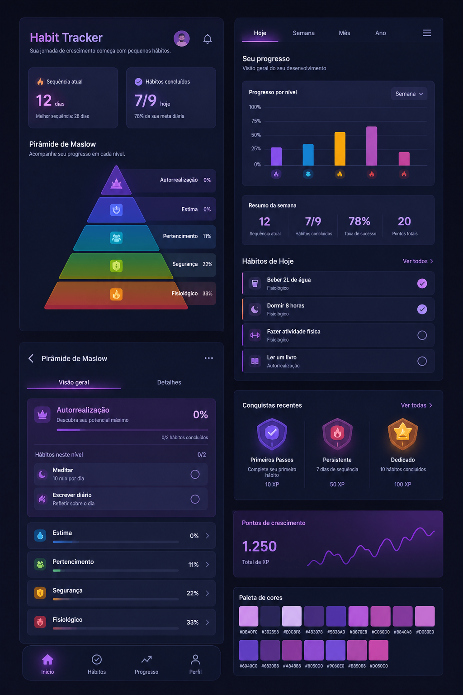

# 🔥 Lovitz — Habit Tracker

<p align="center">
  
</p>

<p align="center">
  <strong>Um aplicativo de acompanhamento de hábitos construído com Flutter, inspirado na Pirâmide de Maslow.</strong>
</p>

---

## 📖 Sobre o Projeto

O **Lovitz** é um aplicativo mobile de rastreamento de hábitos (habit tracker) que utiliza a **Pirâmide de Maslow** como框架 conceitual para organizar e priorizar os hábitos do usuário.

A ideia central é: hábitos que atendem necessidades mais básicas (fisiológicas, segurança) têm prioridade visual e funcional sobre hábitos de necessidades superiores (autorrealização), criando uma experiência de desenvolvimento pessoal estruturada e motivadora.

## 🎯 Propósito

- **Organizar hábitos** por nível de necessidade (Maslow)
- **Visualizar progresso** com indicadores circulares e streaks
- **Motivar consistência** através do sistema de sequências (streaks)
- **Gamificar** o crescimento pessoal com XP e conquistas

## ✅ O que foi feito até agora

### Tela Inicial (`HomeScreen`)

A tela principal replicada fielmente a partir do mockup:

| Elemento | Descrição |
|---|---|
| **Header** | Título "Habit Tracker" com subtítulo, ícone de sino (notificações) e avatar do usuário |
| **Cards de Resumo** | Dois cards lado a lado: "Sequência atual" (🔥 12 dias) e "Hábitos concluídos" (✅ 7/9 hoje) |
| **Pirâmide de Maslow** | Pirâmide customizada com `CustomPainter` — 5 níveis com cores, ícones e porcentagens |
| **Bottom Navigation** | Barra de navegação com Home, Streak, +, Hábitos e Config |

### Pirâmide de Maslow (CustomPainter)

A pirâmide é desenhada via código usando `CustomPaint`:

- **Topo** (triângulo): Roxo — Autorrealização (15%)
- **2º nível** (trapézio): Azul — Estima (28%)
- **3º nível** (trapézio): Verde — Social (42%)
- **4º nível** (trapézio): Amarelo — Segurança (67%)
- **Base** (trapézio): Vermelho — Fisiológico (83%)

Cada nível possui um ícone com fundo translúcido e texto com a categoria + porcentagem.

### Widgets Criados

| Widget | Arquivo | Função |
|---|---|---|
| `MaslowPyramidPainter` | `lib/widgets/maslow_pyramid_painter.dart` | Painter customizado para a pirâmide |
| `ProgressRing` | `lib/widgets/progress_ring.dart` | Anel circular de progresso |
| `HabitCard` | `lib/widgets/habit_card.dart` | Card de hábito com progresso e streak |
| `LegendCard` | `lib/widgets/legend_card.dart` | Cards do "Legends do Dia" |
| `AppBottomNavBar` | `lib/widgets/bottom_nav_bar.dart` | Barra de navegação inferior |

### Modelos de Dados

| Modelo | Descrição |
|---|---|
| `Habit` | Hábito com nome, descrição, nível Maslow, tipo, frequência, meta, streak |
| `HabitRecord` | Registro diário de um hábito (completado, valor, qualidade) |
| `Achievement` | Conquista desbloqueada pelo usuário |
| `AppUser` | Usuário com email, nome e pontos de crescimento (XP) |

### Integração com Backend

O app se conecta a uma API Base44 para persistência de dados:

- **Base URL:** `https://maslow-progress-70d3dad7.base44.app/api`
- **Entidades:** Habit, HabitRecord, Achievement, JournalEntry, User
- **Operações:** CRUD completo (GET, POST, PUT, DELETE)

### Configuração do Projeto

- **Framework:** Flutter (Dart)
- **Plataforma:** Android (configuração completa) + iOS (básica)
- **Gradle:** Android 8.1.0, Kotlin 1.9.0
- **Min SDK:** Android 21 (Lollipop)
- **Tema:** Dark mode com fundo sólido `#120808`

## 📁 Estrutura do Projeto

```
lovitz-app/
├── pubspec.yaml
├── lib/
│   ├── main.dart                         # Entry point
│   ├── main_shell.dart                   # Shell de navegação
│   ├── theme/
│   │   └── app_theme.dart                # Cores, tipografia, sombras
│   ├── utils/
│   │   └── constants.dart                # Configuração da API, níveis Maslow
│   ├── models/
│   │   ├── habit.dart
│   │   ├── habit_record.dart
│   │   ├── achievement.dart
│   │   └── user.dart
│   ├── services/
│   │   └── api_service.dart              # Comunicação com backend
│   ├── screens/
│   │   ├── home_screen.dart              # Tela inicial (mockup)
│   │   └── progress_screen.dart          # Tela de progresso
│   └── widgets/
│       ├── maslow_pyramid_painter.dart   # Pirâmide customizada
│       ├── progress_ring.dart            # Anel de progresso
│       ├── habit_card.dart               # Card de hábito
│       ├── legend_card.dart              # Card de legenda
│       └── bottom_nav_bar.dart           # Navegação inferior
├── android/                              # Config Android
├── ios/                                  # Config iOS
└── assets/                               # Imagens e fontes
```

## 🚀 Como Rodar

```bash
# Clone o repositório
git clone https://github.com/Samfred-hld/Repositorio-Lovitz-Publico.git
cd Repositorio-Lovitz-Publico

# Instale as dependências
flutter pub get

# Execute no emulador ou dispositivo
flutter run
```

## 📋 Próximos Passos

- [ ] Tela de detalhes do hábito
- [ ] Tela de criação/edição de hábito
- [ ] Tela de configurações
- [ ] Sistema de autenticação
- [ ] Integração completa com API
- [ ] Notificações locais
- [ ] Tela de onboarding
- [ ] Suporte a temas (light/dark)

## 🛠️ Tecnologias

- **Flutter** — Framework UI multiplataforma
- **Dart** — Linguagem de programação
- **HTTP** — Comunicação com API REST
- **SharedPreferences** — Armazenamento local
- **Google Fonts** — Tipografia personalizada

## 📄 Licença

Este é um projeto público para fins de desenvolvimento pessoal.

---

<p align="center">
  Feito com ❤️ e Flutter
</p>
